# 📱 DORS — Система управления заказ-нарядами

## Обзор приложения

DORS — это мобильное приложение для управления полевыми работами, предназначенное для техников и инженеров, занимающихся обслуживанием и ремонтом оборудования. Приложение позволяет получать заказы, отслеживать их статус, документировать работу и управлять запасными частями прямо на месте.

---

## 🎯 Основной сценарий использования

### Шаг 1: Авторизация

```
📌 Экран входа
├─ Поле "Логин" — введите учетные данные
├─ Поле "Пароль" — введите пароль
└─ Кнопка "Войти" — вход в систему
```

**Демонстрация:** Входим с логином `1` и паролем `1` для демо-доступа.

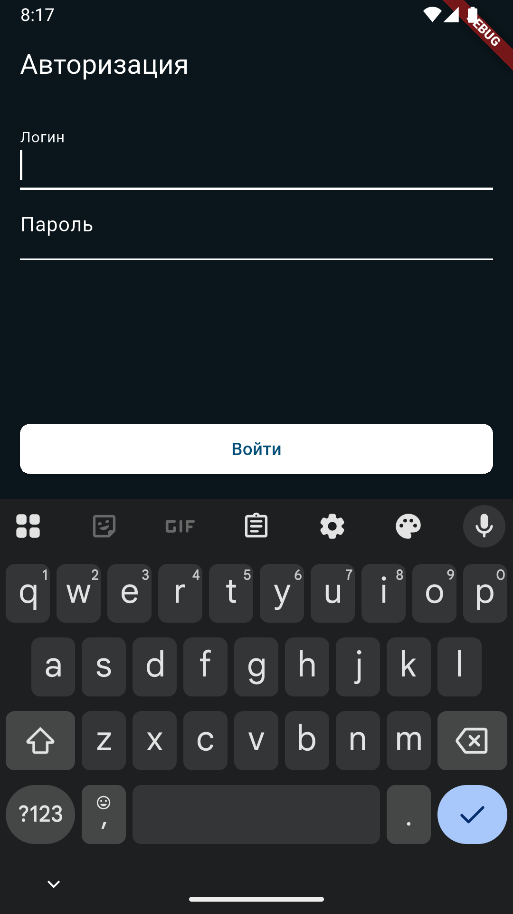 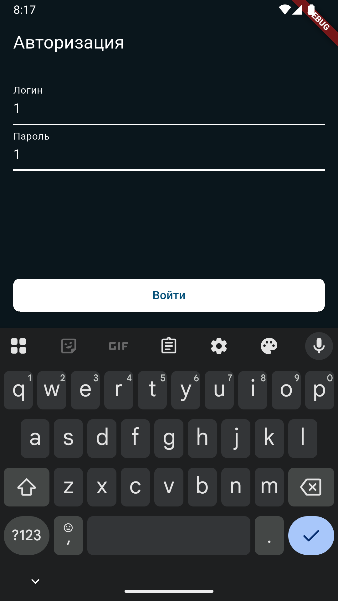

---

### Шаг 2: Запрос разрешений

После входа приложение запрашивает необходимые разрешения:

| Разрешение | Назначение | Демо-действие |
|-----------|-----------|---------------|
| 📍 **Геолокация** | Определение местоположения техника | Выбираем "Использовать при работе с приложением" |
| � **Уведомления** | Получение оповещений о новых заказах | Подтверждаем разрешение на уведомления |

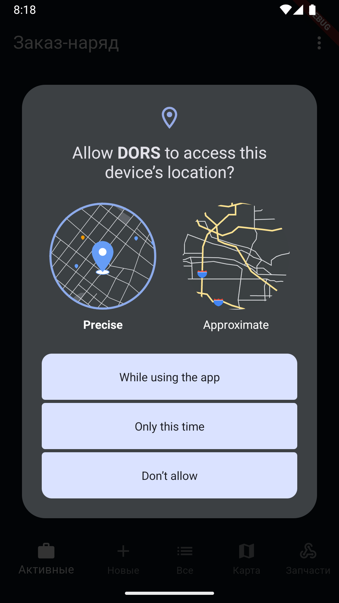

---

### Шаг 3: Главный экран — Список заказ-нарядов

```
📋 ЗАКАЗ-НАРЯД (Active Orders)
├─ Вкладка "Активные" — текущие работы
├─ Вкладка "Новые" — поступившие заказы
├─ Вкладка "Все" — полный список
├─ Вкладка "Карта" — геолокация заказов
└─ Вкладка "Запчасти" — управление инвентарем
```

**Что видим:**
- 📦 Номер документа/заказа
- 📅 Дату назначения
- 👤 Количество задействованных людей
- 📍 Количество объектов
- 🔧 Тип оборудования (Купюроприемник KS-1000)
- 🏷️ Статус (Новый/В работе)

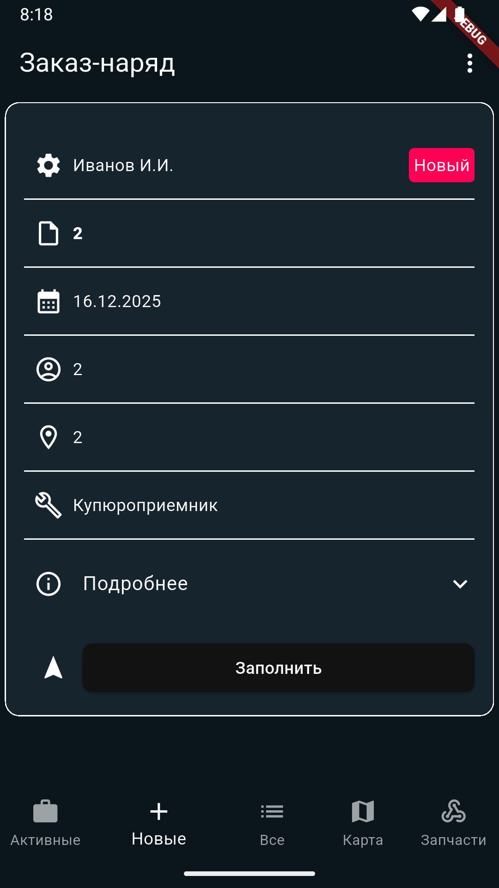 

---

## 📌 Детальный просмотр заказ-наряда

### Базовая информация

| Поле | Описание | Пример |
|------|---------|--------|
| 👤 **Исполнитель** | ФИО техника | Иванов И.И. |
| 📂 **Документы** | Кол-во файлов в заказе | 2-5 документов |
| 📅 **Дата** | Дата выполнения | 16.12.2025 |
| 👥 **Люди** | Кол-во задействованных сотрудников | 2-5 человек |
| 📍 **Места** | Количество адресов для посещения | 2-5 локаций |

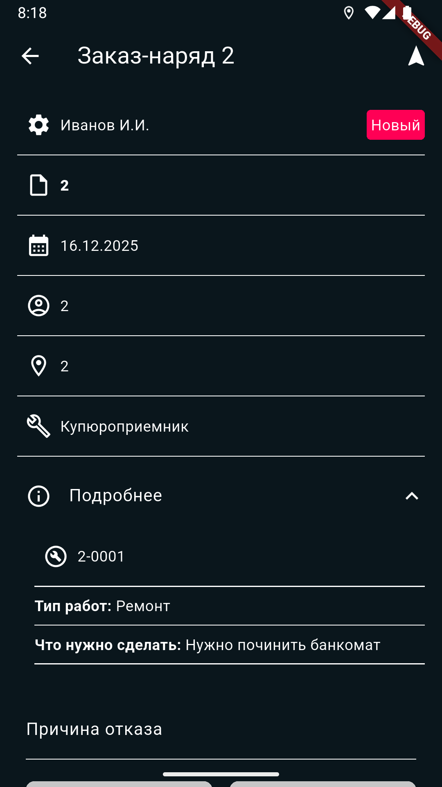 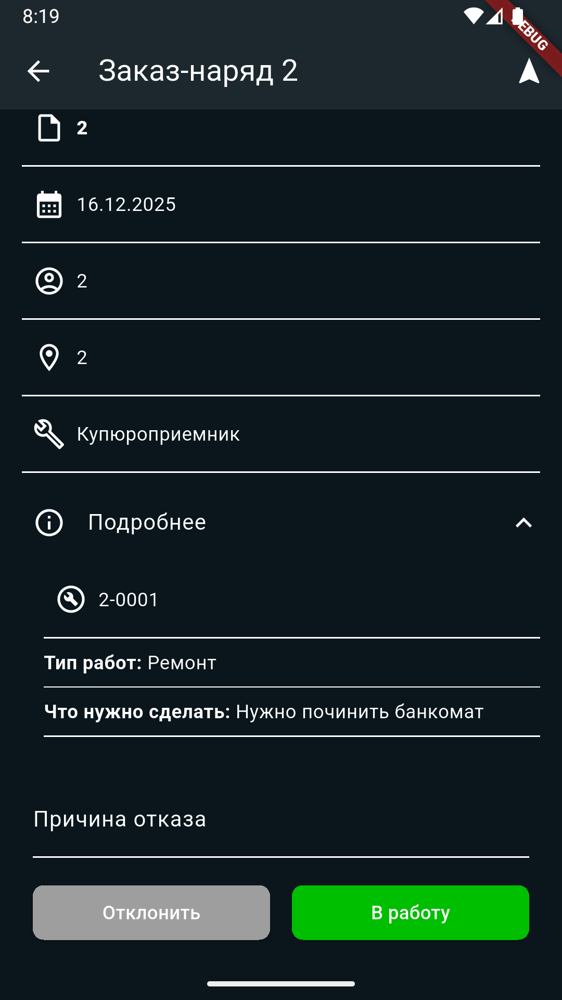

### Данные оборудования

```
🔧 Оборудование: Купюроприемник KS-1000
   • Серийный номер: KS-1000
   • Статус: Новый/В работе/Отказ инженера
   • Информация: Развернуть для подробностей ⬇️
```

### Сведения о работе

**⚠️ Обязательные поля для завершения заказа:**

| Поле | Описание | Обязательно |
|------|---------|-----------|
| 📄 **Номер акта** | Уникальный номер документа о проведенной работе | ✅ Да |
| 🚀 **Начало работ** | Дата и время, когда техник приступил к работе | ✅ Да |
| ⏹️ **Конец работ** | Дата и время завершения работы | ✅ Да |
| ⭕ **Состояние** | Статус оборудования после работы (Рабочее/Неработающее) | ✅ Да |
| 📸 **Фотографии** | Минимум одна фотография состояния оборудования | ✅ Да (минимум 1) |

**Дополнительные поля (опционально):**
- 😊 Рекомендации — советы для клиента
- ✅ Что сделано — описание проведенных работ
- ⚠️ Правильное использование — замечания по использованию

### Кнопка Навигатор

```
🗺️ Кнопка "Навигатор" расположена:
├─ На главных страницах (рядом с кнопкой "Заполнить")
└─ На детальной карточке заказа (сверху справа - треугольник/стрелка)
   ├─ При нажатии открывается навигатор устройства
   ├─ Техник может построить маршрут до объекта работы
   └─ Автоматически используется адрес из заказа
```

### Временные отметки (развернуть "Подробнее")

```
⏱️ Номер акта: 1
🚀 Начало работ: 17.12.2025 08:45
⏹️ Конец работ: 17.12.2025 08:45
😊 Рекомендации: [заполнить при необходимости]
✅ Что сделано: [отметить выполненные работы]
⚠️ Неправильное использование: [отметить найденные проблемы]
⭕ Состояние: Рабочее [выпадающий список]
```

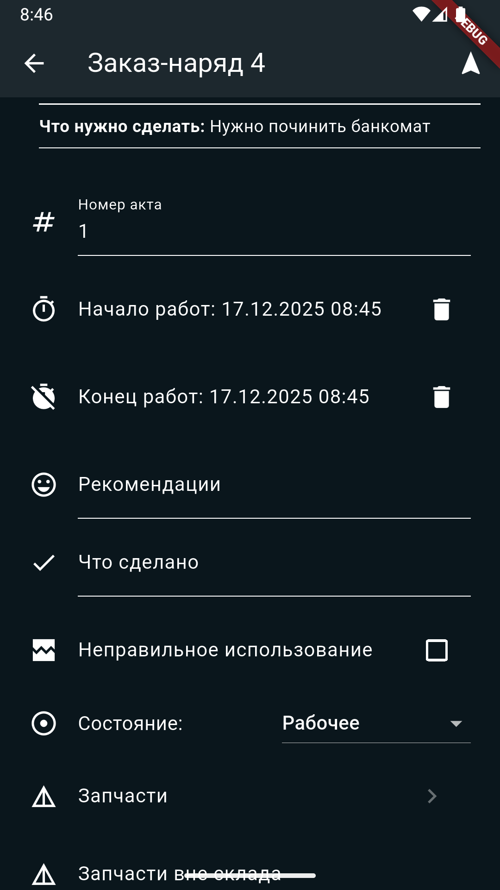 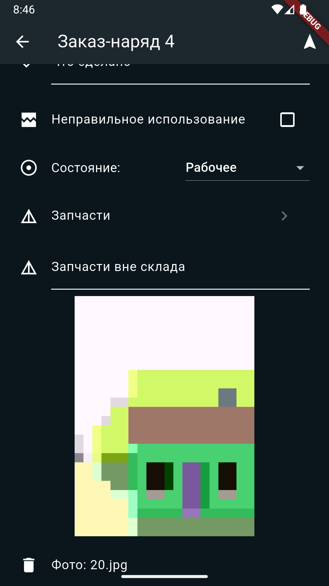

---

## 📦 Управление запчастями

### Экран "Запчасти"

```
🔍 Поиск по названию или серийному номеру
│
└─ Результаты:
   📌 Купюроприемник KS-1000 (KS-1000)
   ├─ Доступно: 8 штук
   ├─ Списано: 0 штук
   └─ Кнопки:
       ➖ Уменьшить количество
       ➕ Увеличить количество
```

**Для демо:** 
- Показываем, как найти запчасть
- Увеличиваем количество списания (0 → 2)
- Объясняем учет материалов

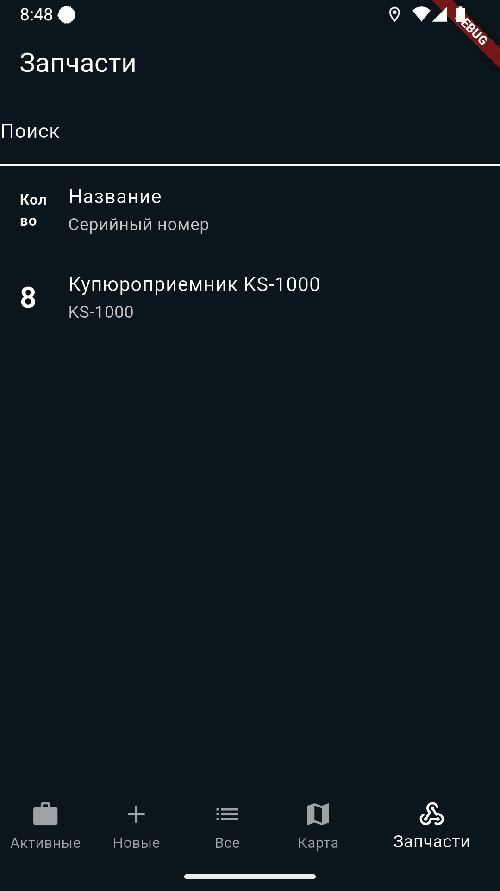  

---

## 📸 Документирование работы

### Раздел "Запчасти вне склада"

```
📷 Фотографии Заказ-наряда
├─ Развернуть для просмотра
├─ Пример фото: photo_20.jpg
└─ Изображение показывает:
    • Текущее состояние оборудования
    • Выявленные проблемы
    • Результаты работ
```

**Для демо:** Показываем фотографию оборудования и объясняем, как техник документирует состояние на месте.

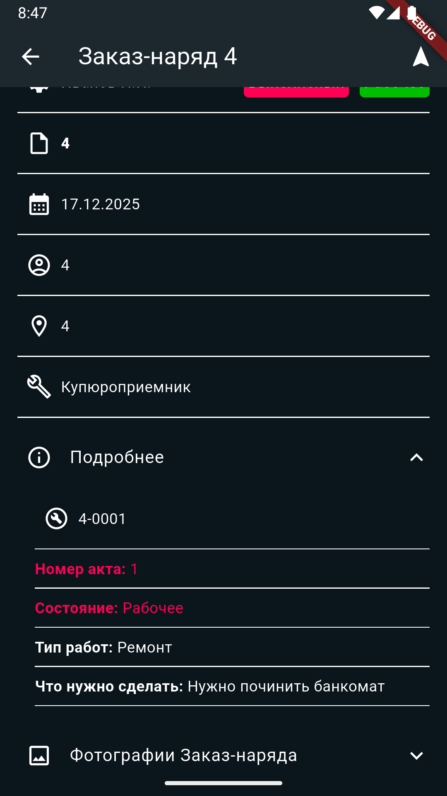

---

## 🎬 Полный сценарий демонстрации

### Этап 1: Вход и разрешения (1 минута)
1. ✅ Вводим учетные данные
2. ✅ Подтверждаем разрешения на геолокацию и камеру
3. ✅ Переходим на главный экран

### Этап 2: Обзор списка (1 минута)
1. 📋 Показываем активные заказы
2. 🗺️ Переходим на карту для демонстрации геолокации
3. 📦 Демонстрируем список запчастей

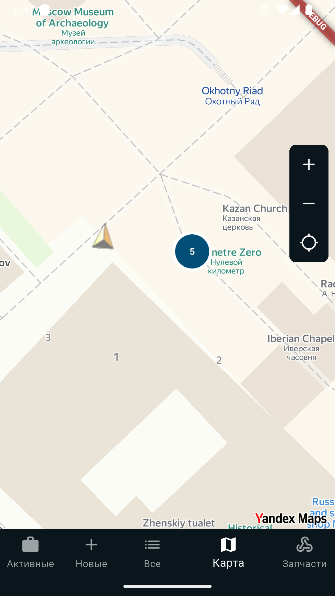 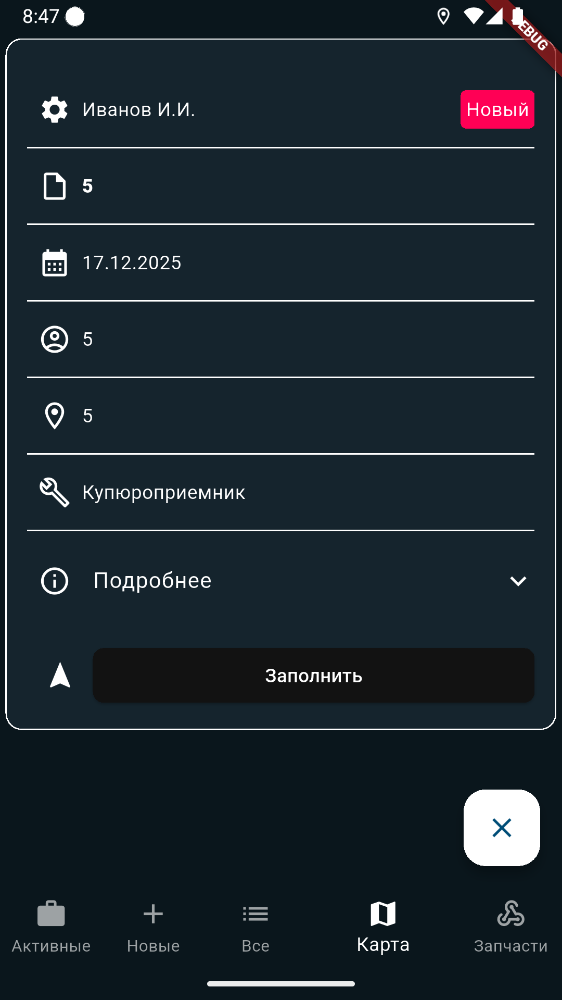

### Этап 3: Работа с заказом (2-3 минуты)
1. 🔓 Открываем заказ "Заказ-наряд 2" (статус "В работе")
2. 👁️ Демонстрируем основную информацию
3. 🔧 Показываем оборудование и параметры
4. 📝 Раскрываем "Подробнее" для просмотра временных отметок
5. 📸 Открываем раздел "Запчасти вне склада" с фото

### Этап 4: Управление статусом (1 минута)
1. ⭕ Показываем выпадающий список статусов
2. 💚 Демонстрируем кнопку "В работу" (зеленая кнопка)
3. 🚫 Демонстрируем кнопку "Отклонить" (серая кнопка)

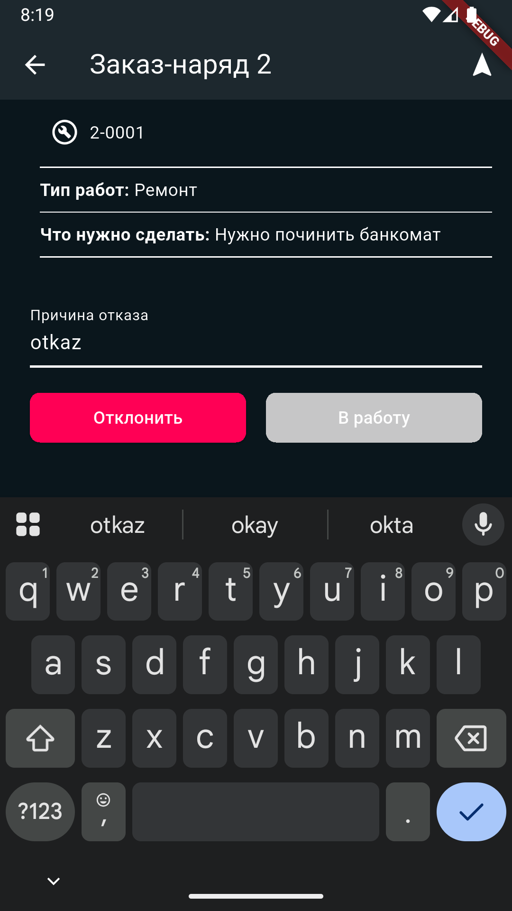

### Этап 4.5: Навигация к месту работы
1. 🗺️ Показываем кнопку **"Навигатор"** (треугольник/стрелка справа вверху на детальной карточке)
2. 📍 Объясняем, что при нажатии открывается навигатор устройства
3. 🛣️ Техник может построить оптимальный маршрут до объекта работы
4. ⏱️ Демонстрируем на карте, как видны маршруты между адресами

---
1. 🔓 Открываем заказ "Заказ-наряд 4"
2. ⚠️ Показываем статус "Отказ инженера"
3. 💬 Демонстрируем поле "Причина отказа" (оказ)
4. 📄 Объясняем, когда заказ возвращается в очередь

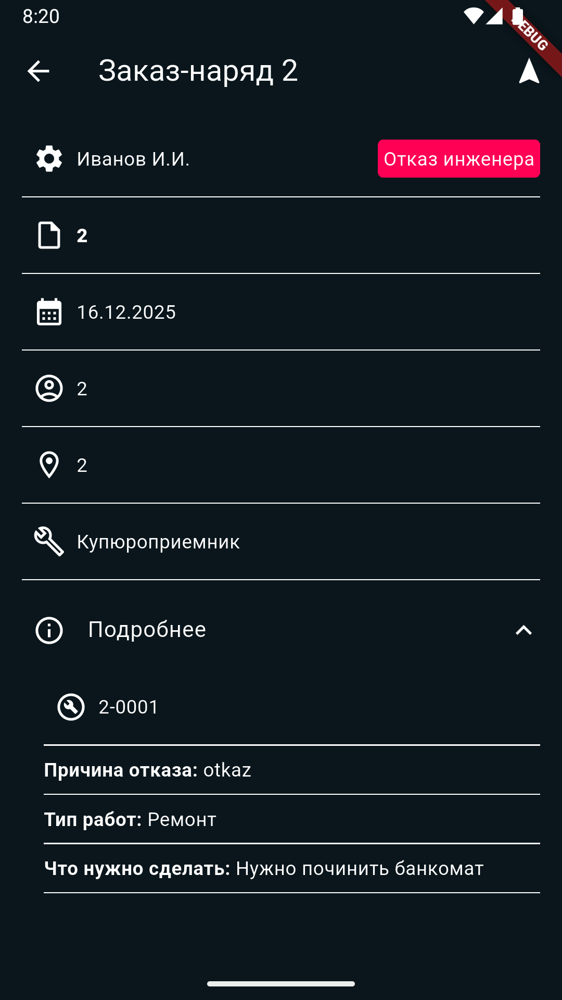

## ✨ Ключевые особенности

| Функция | Преимущество |
|---------|------------|
| 📍 **GPS-навигация** | Техник видит расстояние и маршрут на карте |
| 📸 **Фотофиксация** | Документирование состояния до/после работ |
| 📦 **Учет запчастей** | Контроль использованных материалов в реальном времени |
| ⏱️ **Временной учет** | Точная регистрация начала и конца работ |
| 👥 **Командная работа** | Поддержка групповых заказов |
| 📊 **Полная история** | Сохранение всех актов и заметок |
| 🔄 **Синхронизация** | Автоматическая отправка данных на сервер |

---

## 🎯 Сценарии использования

### Сценарий 1: Успешное выполнение заказа
```
✅ Техник получает заказ
   ↓
📍 Прибывает на место (видит на карте)
   ↓
📸 Фотографирует оборудование
   ↓
🔧 Выполняет ремонт
   ↓
📦 Использует нужные запчасти
   ↓
⏱️ Регистрирует время окончания
   ↓
💚 Нажимает "В работу" (подтверждает завершение)
   ↓
📤 Данные синхронизируются на сервер
```

### Сценарий 2: Невозможно выполнить заказ
```
⚠️ Техник не может выполнить работу
   ↓
💬 Выбирает причину отказа
   ↓
🚫 Нажимает "Отклонить"
   ↓
📤 Заказ возвращается диспетчеру
   ↓
👤 На него назначается другой техник
```

---

##  Заключение

DORS — это **полнофункциональное решение** для управления полевыми работами, которое:

- 🎯 **Упрощает** рабочий процесс техников
- ⚡ **Ускоряет** обслуживание клиентов
- 📊 **Улучшает** контроль и отчетность
- 🔒 **Обеспечивает** полный учет материалов и времени

**Идеально подходит для:** компаний, занимающихся техническим обслуживанием, установкой и ремонтом оборудования.
